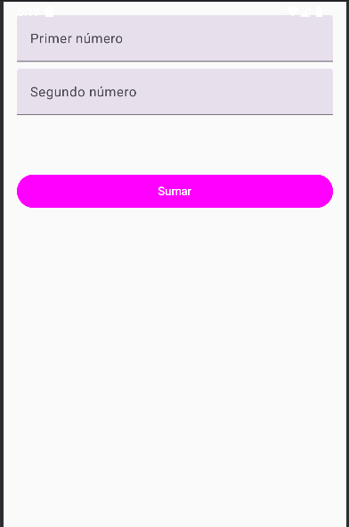
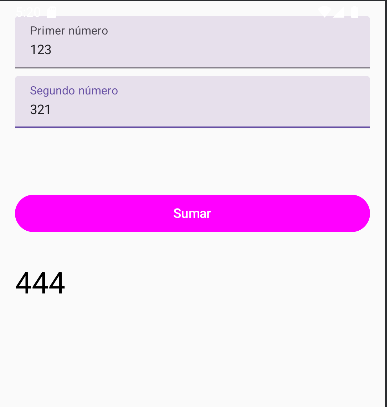
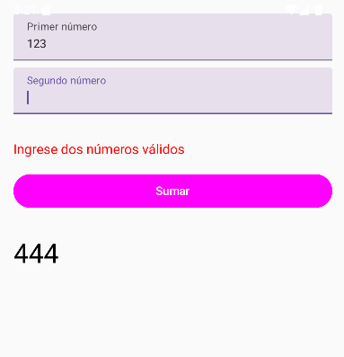

# Proyecto: Calculadora Kotlin + JetpackCompose
Esta aplicacion permite ingresar dos números, realizar una suma y mostrar el resultado en pantalla, manejando adecuadamente los errores de entrada.
Utiliza Kotlin y Jetpack Compose para crear una interfaz moderna declarativa. Características principales:
- **Entradas**: Dos campos de texto para ingresar números.
- **Botón**: Realiza la operación de suma.
- **Salida**: Muestra el resultado al usuario.
- **Manejo de errores**: Detecta errores de entrada como introducir texto en campos númericos o detección de campos vacíos.

---

## Instrucciones de Compilación

### Paso 1: Acceder al Repositorio
Bien hacemos un git clone del repositorio: https://github.com/CrisDeboi/Calculadora-JetpackCompose
O bien lo descargamos como zip.

En cualquier caso nos aseguramos de abrir el proyecto desde nuestro Android Studio.

### Paso 2:Configurar Dispoitivo móvil
Bien conectamos un dispositivo Android físico o inicia un emulador desde Android Studio
 - Para configurar un emulador, ve a **Tools > Device Manager** y sigue las instrucciones para crear un dispositivo virtual.

### Paso 3: Ejecutar la Aplicación
Haz clic en el botón **Run** o usa el atajo `Shift + F10`.

---

## Capturas de Pantalla

### Interfaz de Usuario

### Resultado

### Manejo de Errores

